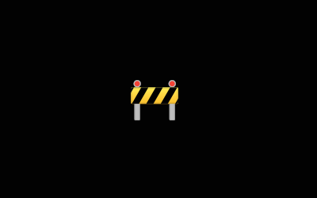

# Front-end

Projetos realizados durante o módulo de Frontend na escola [trybe](https://www.betrybe.com/).
>Visão geral dos Projetos divindo cada projeto com seu respetivo repositório, onde é possível acessar todo código e a aplicação.

<table>
  <tr valign="top">
    <td width="50%" align="center">
      <h2>
        Solar System
      <h2>
      
    </td>
    <td width="50%" align="center">
      <h2>
        Tryunfo
      <h2>
      
    </td>
  </tr>

  <tr valign="top">
    <td width="50%" align="center">
      <h2>
        TrybeTunes
      <h2>
      
    </td>
    <td width="50%" align="center">
      <h2>
        Front-end Online Store
      <h2>
      
    </td>
  </tr>

  <tr valign="top">
    <td width="50%" align="center">
      <h2>
        Testes em React
      <h2>
      
    </td>
    <td width="50%" align="center">
      <h2>
        Trybe Wallet
      <h2>
      
    </td>
  </tr>

  <tr valign="top">
    <td width="50%" align="center">
      <h2>
        Jogo de Trívia
      <h2>
      
    </td>
    <td width="50%" align="center">
      <h2>
        StarWars Datatable
      <h2>
      
    </td>
  </tr>

  <tr valign="top">
    <td width="50%" align="center">
      <h2>
        App de Receitas
      <h2>
      
    </td>
  </tr>
</table>